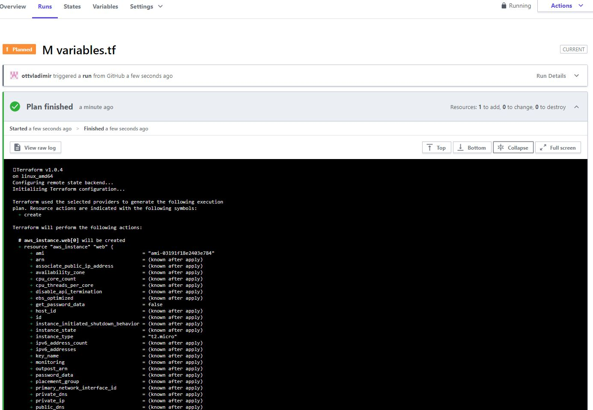

# Домашнее задание к занятию "7.4. Средства командной работы над инфраструктурой."

## Задача 1. Настроить terraform cloud (необязательно, но крайне желательно).


## Задача 2. Написать серверный конфиг для атлантиса. 

server.yaml
```yaml
# repos lists the config for specific repos.
repos:
# атлантис должен работать только для репозиториев в моем github, в ветке main
 - id: https://github.com/ottvladimir
  branch: main
  #
  # apply только для approved изменений
  apply_requirements: [approved, mergeable]
  #workflow по умолчанию
  workflow: my-custom-workflow

  # allowed_overrides specifies which keys can be overridden by this repo in
  # its atlantis.yaml file.
  allowed_overrides: [apply_requirements, workflow, delete_source_branch_on_merge]

  # allowed_workflows specifies which workflows the repos that match 
  # are allowed to select.
  allowed_workflows: [my-custom-workflow]

  # allow_custom_workflows defines whether this repo can define its own
  # workflows. If false (default), the repo can only use server-side defined
  # workflows.
  allow_custom_workflows: true

  # delete_source_branch_on_merge defines whether the source branch would be deleted on merge
  # If false (default), the source branch won't be deleted on merge
  delete_source_branch_on_merge: true
workflows:
  my-custom-workflow:
    plan:
      steps:
      - run: echo "Hello, terraform"
      - init
      - plan:
          extra_args: ["-lock", "false"]
      - run: my-custom-command arg1 arg2
    apply:
      steps:
      - run: echo hi
      - apply
```

atlantis.yaml
```yaml
version: 3
automerge: true
delete_source_branch_on_merge: true
projects:
- name: myprojectStage
  dir: .
  workspace: stage
  terraform_version: v0.11.0
  delete_source_branch_on_merge: true
  autoplan:
    when_modified: ["*.tf"]
    enabled: true
  apply_requirements: [mergeable, approved]
  workflow: myworkflow
- name: myprojectProd
  dir: .
  workspace: prod
  terraform_version: v0.11.0
  delete_source_branch_on_merge: true
  autoplan:
    when_modified: ["*.tf", "../modules/**.tf"]
    enabled: true
  apply_requirements: [mergeable, approved]
  workflow: stage

workflows:
  stage:
    plan:
      steps:
      - run: my-custom-command arg1 arg2
      - init
      - plan:
          extra_args: ["-lock", "false"]
      - run: my-custom-command arg1 arg2
    apply:
      steps:
      - run: echo Stage
      - apply
workflows:
  prod:
    plan:
      steps:
      - run: my-custom-command arg1 arg2
      - init
      - plan:
          extra_args: ["-lock", "false"]
      - run: my-custom-command arg1 arg2
    apply:
      steps:
      - run: echo Prod
      - apply
```
## Задача 3. Знакомство с каталогом модулей. 

1. В [каталоге модулей](https://registry.terraform.io/browse/modules) найдите официальный модуль от aws для создания
`ec2` инстансов. 
2. Изучите как устроен модуль. Задумайтесь, будете ли в своем проекте использовать этот модуль или непосредственно 
ресурс `aws_instance` без помощи модуля?
3. В рамках предпоследнего задания был создан ec2 при помощи ресурса `aws_instance`. 
Создайте аналогичный инстанс при помощи найденного модуля.   

В качестве результата задания приложите ссылку на созданный блок конфигураций. 
